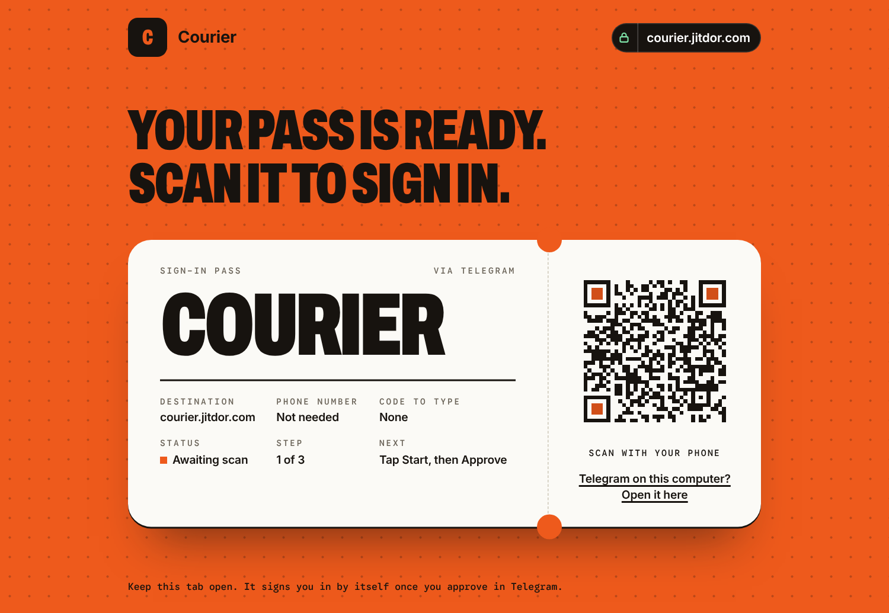
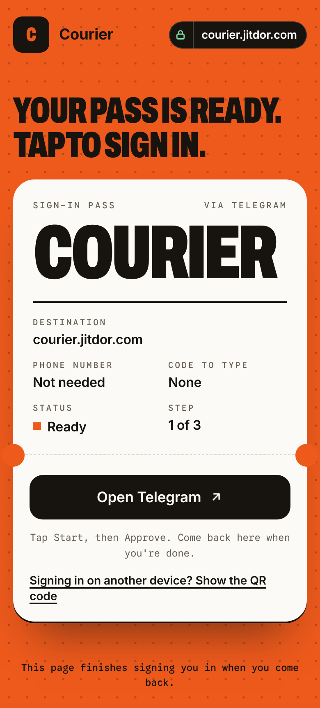
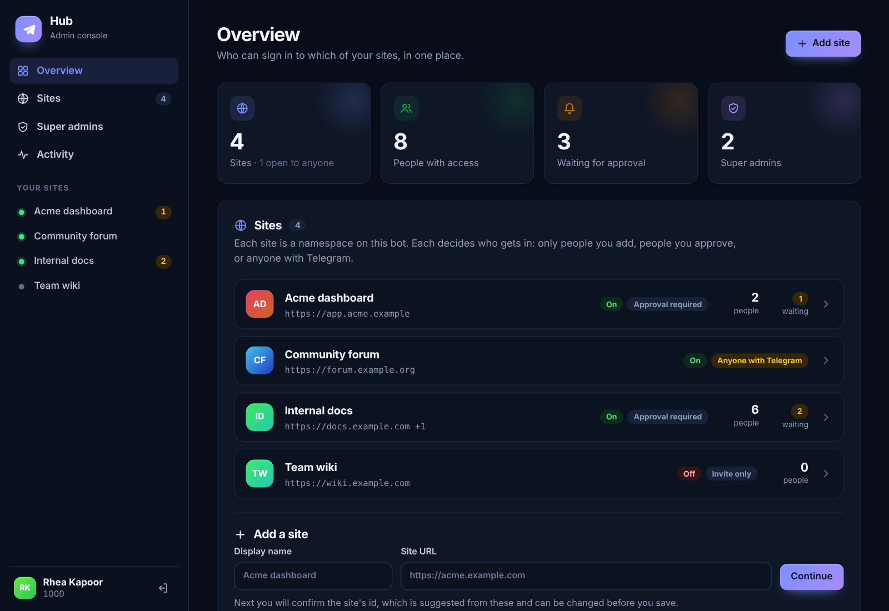
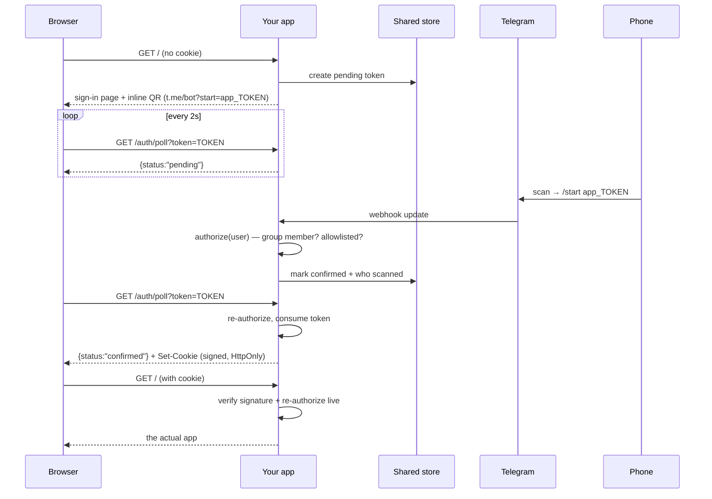
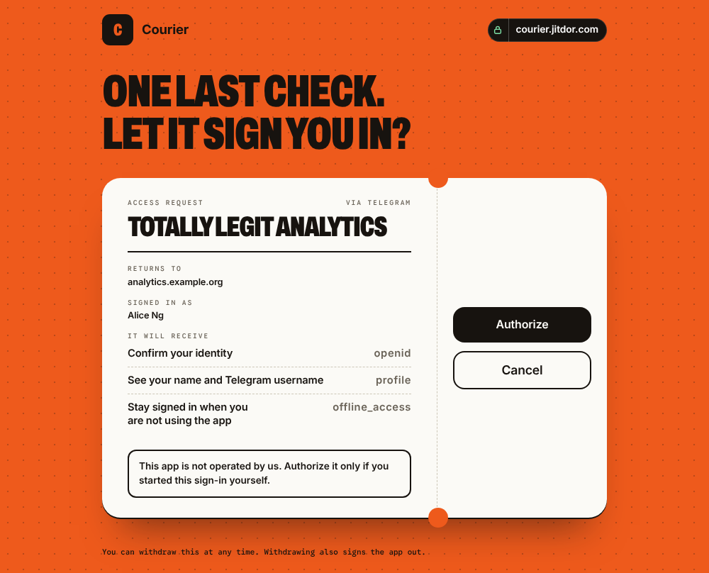

# telegram-qr-signin

**Telegram as an identity provider. One QR scan. Zero user input.**

No phone number. No login code. No password. No form fields at all — the sign-in page has no
`<input>` on it, and the only thing the user does is point their phone at a square.

```
┌──────────────────────────┐
│   Scan to sign in        │        1. page shows a QR encoding
│   ▄▄▄▄▄▄▄ ▄  ▄ ▄▄▄▄▄▄▄   │           t.me/yourbot?start=app_<one-time token>
│   █ ▄▄▄ █ ▀▄▀█ █ ▄▄▄ █   │        2. phone scans it → Telegram sends /start to your bot
│   █ ███ █ █▄▀▄ █ ███ █   │        3. bot checks who they are, confirms the token
│   █▄▄▄▄▄█ ▀ █▀ █▄▄▄▄▄█   │        4. page was polling; it gets a signed session cookie
│   Waiting for scan…      │
└──────────────────────────┘        Total keystrokes: 0
```

Zero dependencies. One file per concern, no build step. Runs on Cloudflare Workers, Deno, Bun and
Node 22.13+.

<p align="center">
  
  &nbsp;
  
</p>

The sign-in page is a boarding pass: the site's name and domain on a ticket, a QR code on its stub
(or, on phones, the button that opens Telegram), and a status that moves from "Awaiting scan" to a
green ADMITTED stamp. It shows the site's name and domain so people can see where they are signing in. With the optional
[hub](#one-bot-many-sites-the-hub) there is also an admin console:

<p align="center">
  
</p>

---

## Why not Telegram's Login Widget

Telegram's official Login Widget authenticates by **phone number entry followed by a code**. There
is no QR path through it — that is a property of the widget, not a configuration option. If you
want a scan-only sign-in, deep-link `/start` payloads are the only mechanism Telegram gives you
where a scan carries a server-chosen nonce back to your own code.

That is what this package packages: the deep-link dance, the one-time token store, the QR
rendering, the session cookie, and the authorization checks — as pieces you can each swap out.

|                          | Login Widget         | telegram-qr-signin              |
| ------------------------ | -------------------- | ----------------------------- |
| User input               | Phone number + code  | **None**                      |
| Works from a laptop      | Yes                  | Yes (scan with your phone)    |
| Works on the phone itself| Yes                  | Yes (tap the link instead)    |
| Third-party JS on page   | Telegram's widget    | **None** — QR is inline SVG   |
| Authorization            | Yours to build       | Pluggable gates, checked live |

---

## How it works



Two halves, one shared store. The **web half** mints and polls; the **bot half** confirms. They are
usually separate deployments (two Workers, or an app plus the bot you already run), which is why
the store is injected rather than in-process.

---

## Install

Not on npm — install straight from GitHub. Releases are git tags (`v1.2.0`, `v1.3.0`, …), and npm
resolves a semver range against them:

```bash
npm install github:jitdor/telegram-qr-signin#semver:^1.2.0
```

`^1.2.0` takes any 1.x release from 1.2.0 up and never a breaking 2.0. Pin an exact release with `#v1.2.0`, or
track the unreleased tip of `main` with plain `github:jitdor/telegram-qr-signin`. npm records the
exact commit it fetched in your lockfile, so **commit `package-lock.json`**: installs stay
reproducible, and you only move when you choose to:

```bash
npm update telegram-qr-signin      # fetch the newest release inside your range
```

**Knowing when there is an update.** Watch the releases: `https://github.com/jitdor/telegram-qr-signin/tags.atom`
in a feed reader, or GitHub's **Watch → Custom → Releases** on the repo. Breaking changes only ever
arrive in a new major version.

It lands in `node_modules/telegram-qr-signin` and imports by that name either way. Vendoring the
`src/` directory into your own repo is also a legitimate option: it is nine dependency-free ESM
files with no build step, and that is partly the point.

---

## Quickstart — Cloudflare Workers

**1. One KV namespace** — no database, no schema, no migration:

```bash
wrangler kv namespace create LOGINS
```

> KV is the quickest to set up and the slowest to sign in: it is eventually consistent, so a scan can
> take tens of seconds to reach the browser. For anything people will actually use, swap in
> `new D1LoginStore(env.DB)` (apply `migrations/d1.sql` once) or a Durable Object: see
> [Picking a store](#picking-a-store).

**2. The web half:**

```js
import { createTelegramQrAuth, KVLoginStore, chatMember } from "telegram-qr-signin";

const auth = (env) => createTelegramQrAuth({
  botToken: env.TELEGRAM_BOT_TOKEN,
  botUsername: env.TELEGRAM_BOT_USERNAME,   // without the "@"
  store: new KVLoginStore(env.LOGINS),
  namespace: "myapp",
  authorize: chatMember({ chatId: env.CHAT_ID }),
});

export default {
  async fetch(request, env) {
    const a = auth(env);

    // /auth/login, /auth/poll, /auth/logout, /auth/qr, /auth/q/<token> — null for anything else
    const handled = await a.handle(request);
    if (handled) return handled;

    const gate = await a.guard(request);
    if (!gate.ok) return gate.response;      // the sign-in page, or 403

    return new Response(`Hello ${gate.session.name}`);
  },
};
```

**3. The bot half** — in the Worker that receives your bot's webhook:

```js
import { createWebhookHandler } from "telegram-qr-signin/bot";

// as a whole endpoint...
export default { fetch: (req, env) => createWebhookHandler(auth(env), { secretToken: env.HOOK_SECRET })(req) };
```

...or, if you already have a bot with its own `/start` handling, drop one call into it:

```js
const signIn = await auth(env).handleStart({ text: message.text, from: message.from });
if (signIn.matched) {
  await bot.sendMessage(message.chat.id, signIn.replyText);
  return;                                   // it was a sign-in link, not a normal /start
}
```

`handleStart` returns `{ matched: false }` for anything that isn't a sign-in link for **this**
namespace, so one bot can front several apps without them colliding.

A bot has only one webhook, though, so with several apps the question is who receives it. For that,
and for managing who may enter which app, see [One bot, many sites](#one-bot-many-sites-the-hub).

`createWebhookHandler` always answers `200 ok`, even when handling an update throws (a Telegram
outage while sending the reply, say). The sign-in is confirmed before the reply is sent, and
Telegram holds every later update behind one it is retrying, so a single failed reply would
otherwise block every sign-in after it. Errors go to `onError(err, update)`, which defaults to
`console.error`. If a webhook is already stuck (`getWebhookInfo` shows a growing
`pending_update_count`), clear the queue by setting the webhook again with
`drop_pending_updates=true`:

```bash
curl "https://api.telegram.org/bot$TOKEN/setWebhook?url=$URL&secret_token=$SECRET&drop_pending_updates=true"
```

In your own bot code, do the same: ack the update even when your reply fails.

A complete deployable version of both halves is in
[`examples/cloudflare-worker/`](examples/cloudflare-worker/worker.js), and a Cloudflare-free
Node version in [`examples/node-server/`](examples/node-server/server.mjs).

---

## Deploying

### What the QR points at

**Default: `https://t.me/<bot>?start=…`.** Nothing to configure. It is an https link, so a phone
camera offers to open it, and Telegram's t.me page hands off to the app on every platform, with or
without the app installed. The QR never encodes a `tg://` link: many Android cameras decode one
but treat it as plain text, with no button to tap. (`tg://` is used only for the on-page button
and for clicking the QR on a computer, where no camera is involved.)

**Optional: your own domain, with `qrOrigin`.** Give the package an https domain you serve the app
at, and the QR encodes an address there instead, which redirects to the same t.me link:

```js
createTelegramQrAuth({ ..., qrOrigin: "https://app.example.com" });
```

```
phone camera → https://app.example.com/auth/q/<token> → 302 → https://t.me/yourbot?start=app_<token> → Telegram
```

What that buys you:

- **The user sees whose site it is.** The camera preview shows `app.example.com`, not `t.me`. That
  is your brand, and one more chance to spot a phishing QR (see
  [QR phishing](#qr-phishing--read-this-one)).
- **A dead code says so.** A code that expired or was already used gets a short "this sign-in code
  has ended" page (HTTP 410) instead of opening Telegram for a `/start` that can only fail.
- **A web link every camera recognises.** If some scanner in your users' hands is unsure about
  `t.me`, a plain https address on your domain removes the doubt.

The cost is one extra hop through your app on every scan, and a domain you have to keep pointing
at it. If you don't want that, leave `qrOrigin` unset.

Opening `/auth/q/<token>` is read-only. It neither confirms nor spends the token, so link previews
and scanner apps that prefetch URLs do no harm: only a `/start` from the scanner's own Telegram
account signs anyone in. The redirect only ever goes to `t.me/<botUsername>`, so it cannot be used
as an open redirect. Nothing on the Telegram side changes: same bot, same `/start` payload, same
webhook.

### Turning on `qrOrigin`

1. **Pick the domain.** It must be https and must reach the app that holds the login store: a
   custom domain or route on the Worker, its `workers.dev` hostname, or the public hostname of a
   Node, Bun or Deno server behind your proxy. Only the origin is used; a path in the value is
   ignored.
2. **Route `/auth/q/*` to the package on that domain.** `auth.handle(request)` already does, as it
   handles everything under `basePath` (`/auth` by default; the QR uses `<basePath>/q/<token>`). If
   you route the endpoints yourself instead of calling `handle`, send `${auth.paths.scan}/<token>`
   to `auth.scan(request)` as well.
3. **Set it in config.** On Cloudflare, keep it in a var so each environment can have its own:

   ```jsonc
   // wrangler.jsonc
   "vars": { "QR_ORIGIN": "https://app.example.com" }
   ```

   ```js
   qrOrigin: env.QR_ORIGIN,     // unset → the default t.me QR
   ```

   The bot half does not need it; only the half that renders QRs does.

The QR uses `qrOrigin` whichever hostname served the sign-in page, so a page loaded from
`localhost` while developing still gets a QR that a phone can open, as long as the domain itself is
live.

### Checking a deployment

1. Open the sign-in page on a computer, then scan it with the **phone's own camera app**, not the
   scanner inside Telegram. The camera should offer to open `t.me/…` (default) or your domain (with
   `qrOrigin`), and tapping that should land in the bot's chat in Telegram.
2. With `qrOrigin`: copy the link the camera shows and open it again after signing in. You should
   get the "code has ended" page, not Telegram.

`GET /auth/qr` returns the exact address the QR encodes as `qrLink`, which is handy for checking
from a script:

```bash
curl -s https://app.example.com/auth/qr | jq -r .qrLink
```

---

## Authorization

Authentication ("who is this?") is identical for every app. Authorization ("do they get in?") never
is — so it is a function you supply:

```js
async (user, ctx) => boolean | { ok: boolean, reason?: string }
```

None of these need a database — they either ask Telegram or read a string.

```js
import { chatMember, chatMemberOfAny, chatMemberOfAll, allowlist, denylist, every, some, anyUser } from "telegram-qr-signin";

chatMember({ chatId: "-1001234567890" })              // the group IS the access list (a muted
                                                      // user counts only while still in it)
chatMember({ chatId, statuses: new Set(["creator", "administrator"]) })   // admins only
chatMemberOfAny("-100111,-100222")                    // in ANY of these groups
chatMemberOfAll("-100111,-100222")                    // in EVERY one of them
allowlist("39644372,12345")                           // ids straight from an env var
denylist(env.BLOCKED)
every(chatMember({ chatId }), allowlist(env.ADMINS))  // in the group AND on the shortlist
some(allowlist(env.STAFF), chatMember({ chatId }))
anyUser()                                             // the default — override it
```

Your own gate is just a function:

```js
authorize: async (user) => {
  const row = await db.prepare("SELECT 1 FROM staff WHERE telegram_id = ?").bind(user.id).first();
  return row ? true : { ok: false, reason: "not_staff" };
}
```

**The gate runs at up to four points**, and `ctx.stage` tells you which (`"refresh"` applies only
if you run the OIDC provider):

| `stage`     | When                                    | Why it matters                                        |
| ----------- | --------------------------------------- | ----------------------------------------------------- |
| `"confirm"` | The bot receives the scan               | An unauthorized scan is refused *before* the token is spent |
| `"poll"`    | The browser redeems the confirmed token | Closes the gap between scan and redemption            |
| `"session"` | **Every** guarded request               | Access revoked in Telegram is revoked here immediately |
| `"refresh"` | OIDC provider: a refresh-token grant    | Someone removed from the group cannot keep minting tokens |

A gate that cannot decide — the built-in `chatMember` when Telegram is unreachable — returns
`{ ok: false, reason: "telegram_unavailable", transient: true }`. Refusals flagged `transient`
are answered with a 503 / "try again" and never sign anyone out or revoke anything, so an outage
does not become a mass logout. Custom gates should do the same.

That last row is the important one: because the gate re-runs on every request, removing someone
from the group locks them out on their next page load — not whenever their cookie happens to
expire.

---

## Storage — what state actually exists

Worth being precise, because "requires a database" would be the wrong impression:

| State                  | Where it lives                                    | Storage needed        |
| ---------------------- | ------------------------------------------------- | --------------------- |
| **Who your users are** | Telegram. It's already the identity provider.     | **None, ever.** There is no user table in this package. |
| **Who is allowed in**  | A group membership check, or an env var           | **None** — `chatMember({ chatId })` asks Telegram; `allowlist(env.ALLOWED_IDS)` reads a string |
| **The session**        | A signed `HttpOnly` cookie on the client          | **None** — stateless  |
| **A sign-in in flight**| A 10-minute record: "token X was confirmed by user Y" | One key-value write |

Only the last row needs anywhere to put anything, and it needs it for ten minutes. It cannot be
avoided or moved into config: the browser is polling in one process while the phone confirms in
another, so *something* has to be written by one and read by the other. (If both halves genuinely
share a process — a single Node server that also long-polls the bot — `MemoryLoginStore` needs
nothing at all.)

### Picking a store

| Store              | Setup                          | Use when                                                  |
| ------------------ | ------------------------------ | --------------------------------------------------------- |
| `D1LoginStore`     | one table, one migration       | **Recommended for Workers.** Strongly consistent: a scan reaches the browser on its next poll, and one scan is one sign-in |
| `DoLoginStore`     | one Durable Object class       | The same guarantees, with no database to provision         |
| `KVLoginStore`     | `wrangler kv namespace create` | Nothing to migrate, TTL cleanup free, **but slow**: a confirmed scan can take tens of seconds to show up (see below) |
| `MemoryLoginStore` | nothing                        | Both halves in one process, or tests                       |

```js
new KVLoginStore(env.LOGINS, { prefix: "tgqr:" })
new D1LoginStore(env.DB, { table: "telegram_qr_logins", sweepAfterSeconds: 86400 })
new DoLoginStore(env.QRAUTH_DO, { name: "default" })
new MemoryLoginStore()
```

**Durable Object store.** Export the class from your Worker, bind it, and pass the binding:

```js
import { DurableObject } from "cloudflare:workers";
import { defineQrAuthStorage, DoLoginStore } from "telegram-qr-signin/do";
export class QrAuthStorage extends defineQrAuthStorage(DurableObject) {}
// wrangler.jsonc: durable_objects.bindings [{ name: "QRAUTH_DO", class_name: "QrAuthStorage" }]
//                 migrations [{ tag: "v1", new_sqlite_classes: ["QrAuthStorage"] }]
```

It is strongly consistent and `confirm` is atomic, like D1, but the object creates its own tables, so
there is nothing to provision or migrate. It has its own entry point so deployments that don't use
Durable Objects (or OIDC) never load that code. For the OIDC provider use `DoOidcStore`, from the
same `telegram-qr-signin/do` entry point (also re-exported by `telegram-qr-signin/oidc`); one object can
hold both. If the bot is a separate Worker, bind the
class there with `script_name`, and use the same `name` on both sides.

**The KV trade-off, stated honestly.** KV is eventually consistent, and for a sign-in that is a real
cost: the browser polls for a record the bot has just written, and a Worker that has already read the
old "pending" value can keep being served it for tens of seconds, so people sit on "Waiting for
Telegram…" long after they approved in the app. Use KV only if a delay like that is fine for you. And its
`confirm` and `consume` are read-then-write with no compare-and-swap available, so two *genuinely
simultaneous* scans of the same QR could both succeed, and two polls landing in the same instant
could both redeem one confirmation. Note what that costs: every resulting session belongs to
someone who passed the authorization gate, not to an unauthorized user, and the token is gone once
either delete lands, so it can't be replayed later. If you want one QR to mean exactly one session
always, use `D1LoginStore` (a conditional `UPDATE` to confirm, a `DELETE … RETURNING` to redeem,
both atomic by construction) or `DoLoginStore`.

D1 needs its table created once:

```bash
wrangler d1 execute my-db --remote --file=node_modules/telegram-qr-signin/migrations/d1.sql
```

### Writing a store

Five methods, ~50 lines. Redis, Postgres, a Durable Object, Deno KV — all fine:

```js
class MyStore {
  async create({ token, namespace, expiresAt, client }) {}
  async get(token, namespace) {}                    // -> record | null
  async confirm(token, namespace, user) {}          // -> true only if it was still pending
  async consume(token, namespace) {}                // -> the record, removed, only if confirmed
  async remove(token, namespace) {}
}
```

`confirm` and `consume` must each be atomic: `confirm` so two scans can't both succeed, `consume`
so two polls can't both turn one confirmation into a session. A store without `consume` still
works, through a non-atomic `get` + `remove`, but loses that second guarantee.

`tests/stores.test.mjs` runs one contract suite across all the bundled stores — point it at yours
to check it behaves.

---

## Theming

The built-in page needs no styling to look right. It is laid out as a boarding pass and follows the
device it is opened on: a computer shows the QR and an "open it here" link; a phone leads with an
**Open Telegram** button and keeps the QR behind "Signing in on another device?"; a tablet shows both,
side by side when held sideways and stacked when upright. The pass carries the site's name in big
letters, its first letter as the mark in the corner and the address it is served from top right (in a browser-style pill, with a lock on its own segment, which shows an open padlock instead when the page is known to be served over plain http) and as
the destination, and spells out that no phone number or code is needed. Its status follows the
sign-in (Awaiting scan, then Signed in with an ADMITTED stamp; Expired and Not allowed have their own
endings. Its type is Archivo (headline and name), Inter and Google Sans Code (the small labels, hints and footnotes), all SIL OFL, bundled in
`src/fonts` and served by your own app (see below). It makes no request to anyone else: no font
service, no images, no scripts from anywhere else, and its tab icon is inline.

Where the name comes from: `branding.siteName` if you set it, else the hub's site name, else the first
label of the address the page is served from (`courier.example.com` becomes "Courier"). The address comes from
the request. With none of those the mark is Telegram's plane.

Restyle it:

```js
branding: {
  title: "Acme — Sign in",
  siteName: "Acme Dashboard",               // the pass's name; its first letter is the mark
  accent: "#0ea5e9",                        // the page colour; text on it turns white if that reads better
  heading: "Your pass is ready.",           // headline, first line
  scanHeading: "Scan it to sign in.",       // second line on a computer or tablet
  tapHeading: "Tap to sign in.",            // second line on a phone
  logoHtml: '',  // replaces the mark
  botSuccessText: "✅ You're in — back to your browser.",
}
```

Every other word on the page can be replaced too (`kickerText`, `destinationLabel`, `phoneText`,
`codeText`, `stepText`, `nextText`, `stampText`, `footText`, `mobileFootText`, `showQrText`, …; see
`DEFAULT_BRANDING`), for translation or a different tone.

**Fonts.** `auth.handle()` serves the three fonts at `<basePath>/fonts/<name>-<hash>.woff2` (so
`auth.paths.fonts` is `/auth/fonts` by default), cached for a year, and the page preloads them. They
are subset to Basic Latin, Latin-1 and common punctuation (about 73 KB in all); other scripts use the
system font. Nothing else is needed as long as `/auth/*` reaches `auth.handle()`, which it must for
the poll to work anyway. A custom `renderLoginPage` is given `fontsPath` and can use
`fontFaceCss(fontsPath)` from `telegram-qr-signin/fonts`. To use your own fonts instead, put an
`@font-face` and `:root { --tqa-display: "Your Font", ...; }` in `headHtml` (`--tqa-font` and
`--tqa-mono` work the same way). `scripts/build-fonts.sh` regenerates the bundled files. A `<link rel="icon">` in `headHtml` replaces the built-in tab icon. Motion is switched off
for visitors who ask for less of it.

> **Upgrading from 1.2:** the page was redesigned, so the options that styled the old card are
> gone: `subtitle`, `background`, `gradientFrom`, `gradientTo`, `qrDark`, `qrLight` and the
> three-step list (`stepsLabel`, `stepOneText`, `stepTwoText`, `stepThreeText`). They are ignored,
> not errors. `accent` now colours the whole page, and `heading` is the first line of the headline
> rather than a title above the card: to name the site, use `siteName`.

**The QR is always an https link.** The QR image encodes the `https://t.me/<bot>?start=…` deep
link, or with `qrOrigin` set an address on your own domain that redirects to it (see
[Deploying](#what-the-qr-points-at)), because an https link is what a phone camera can open.
Clicking the QR on a computer, and the "Open Telegram to sign in" button that touch devices get
instead, both use the app link
`tg://resolve?domain=<bot>&start=…`. That opens the installed Telegram app directly, without the
t.me web page, the "Open in Telegram?" prompt and the extra browser tab that the https link leaves
behind. The sign-in page itself stays put and keeps polling. `tg://` is handled by Telegram on
Android, iOS/iPadOS, macOS and Windows; without Telegram installed the link does nothing, and the QR
is still there. If the user has opened the bot before, Telegram shows a **Start** (or **Restart**)
button rather than sending `/start` by itself, and the default mobile copy says so.

The page polls straight away when its tab becomes visible again, when it is restored from the
back/forward cache, or when its window regains focus, so coming back from Telegram does not mean
waiting out a throttled background timer.

**Getting back to the page.** A bot cannot switch apps for the user, and neither can the page. What
the sign-in can do is say how: when the page was open in a phone or tablet browser, the bot's success
message adds a line such as `↩ To go back, tap "◀ Safari" at the top-left of your screen.` (iOS shows
that chip when Telegram was opened from a link in the browser) or `↩ To go back, swipe back or switch
to Chrome.` on Android. Computers get nothing, since their browser signs itself in. Turn it off with
`createStartHandler(auth, { showReturnHint: false })`.

The button and QR wording is `branding.mobileLinkText`, `tabletLinkText`, `mobileSubtitle`,
`qrHintText` and `qrLinkTitle`; the page a phone sees for an ended code uses `scanEndedHeading` and
`scanEndedText`.
A custom `renderLoginPage` should keep this: show `qrSvg` (it already encodes `qrLink`), and link
the QR and the button to `appLink`, in the same tab.

Or replace the page entirely:
`renderLoginPage({ token, deepLink, appLink, qrLink, qrSvg, error, pollPath, pollIntervalMs, redirectTo, origin, site })`
returns an HTML string (or a promise of one). `origin` is where the page is being served from; `site`
(`{ name, host }`, supplied by the [hub](#one-bot-many-sites-the-hub)) is the pass's name and address,
and `name` becomes the title "Sign in to <name>" unless you set `branding.title`. The contract a replacement must keep is polling `pollPath` and handling the
five statuses in `POLL_STATUSES`: `pending` · `confirmed` · `expired` · `invalid` · `denied`. The
built-in page's polling script is exported, so a custom page only needs to supply markup:

```js
import { pollScript, escapeHtml } from "telegram-qr-signin";

renderLoginPage: ({ token, appLink, qrSvg, pollPath, pollIntervalMs, redirectTo }) => `
  <!doctype html>
  <a id="open" href="${escapeHtml(appLink)}">Open Telegram</a>
  <div id="qr"><a href="${escapeHtml(appLink)}">${qrSvg}</a></div>
  <p id="status">Waiting for scan…</p>
  <script>${pollScript({
    token, pollPath, pollIntervalMs, redirectTo,
    texts: { success: "Signed in", expired: "Expired", denied: "Not allowed", retry: "New code" },
    ids: { status: "status", qr: "qr", hide: ["open"] },
  })}</script>`,
```

`ids.status` gets the status text, `ids.qr` is replaced by a "new code" button on expiry, and the
`ids.hide` elements are hidden once the sign-in is over, since they would open a dead token. The
script also sets `data-tqa-state` on `<html>` to `waiting`, `signed-in`, `expired` or `denied`, so a
status indicator can be styled in CSS alone. Escape what you interpolate into the markup yourself,
as above; `pollScript` already makes its own values safe inside `<script>`.

Rendering your own UI entirely? `GET /auth/qr` returns
`{ token, deepLink, appLink, qrLink, svg, expiresIn, pollPath }` as JSON, or call
`auth.beginLogin({ request })` directly. If you draw the QR yourself, encode `qrLink`, not
`deepLink`.

### Returning to the page that was asked for

When `guard()` serves the sign-in page, it sends the browser back to the requested path after
sign-in, so a signed-out link to `/tickets/x.pdf` lands on `/tickets/x.pdf`, not `/`. Pass
`guard(request, { redirectTo: "/somewhere" })` to choose. Only same-site paths are accepted (a
single leading `/`, no `//`, no backslashes); anything else, and any non-GET request, falls back to
the configured `redirectTo`, so the page cannot be used to send people to another site. The same
check applies to `loginPage({ redirectTo })` and `loginResponse({ redirectTo })`, and is exported
as `sameSitePath(value)`.

### Service workers

`Cache-Control: no-store` keeps browsers and proxies from caching the sign-in page, but a service
worker's Cache API ignores it. If your app has an offline service worker, it could save the sign-in
page as its offline copy of `/`. Every sign-in page response carries `X-Telegram-Qr-Auth: login`
(exported as `LOGIN_PAGE_HEADER`), so skip those responses:

```js
// in the service worker
const response = await fetch(event.request);
if (response.ok && response.headers.get("X-Telegram-Qr-Auth") !== "login") {
  await cache.put(event.request, response.clone());
}
```

To wipe offline copies when the user signs out, route logout yourself (before calling
`auth.handle`) and return `auth.logoutResponse({ clearSiteData: true })`. That adds
`Clear-Site-Data: "cache", "storage"`, which clears the HTTP cache, Cache API, storage and service
workers for the **whole origin**, not just this app.

---

## Running a public identity provider

Everything above assumes you own every app that verifies a session. If third parties need to sign
users in, that assumption breaks in a specific way: HMAC verification and HMAC forgery use the same
key, so a relying party that can check a token can also mint one — for any user, to any of your
apps.

`telegram-qr-signin/oidc` is the answer to that: a standards-compliant OpenID Connect provider with
the QR scan as its authentication method. ES256 signing, published JWKS, per-client audiences,
PKCE, consent, and refresh rotation with reuse detection. Relying parties integrate with a stock
OIDC library and never learn Telegram is involved.

The sign-in page, the consent screen and the error page are one design: the same pass, fonts and
colours, restyled by the same `branding` you give `createOidcProvider`. The consent screen puts the
requesting app's name on the ticket in big letters, lists what it will receive, shows the host it
returns to, and keeps the warning that the app is not operated by you. Its words are
`consentHeading`, `consentSubheading`, `consentWarnText`, `allowText`, `denyText` and the rest listed
in `DEFAULT_BRANDING`. The top bar shows the provider's own name (`branding.siteName`, else the first
label of the issuer's host) and address, so the app asking is never mistaken for the provider.

<p align="center">
  
</p>

```js
import { createOidcProvider, loadSigningKeys, StaticClientRegistry, D1OidcStore } from "telegram-qr-signin/oidc";

const oidc = createOidcProvider({
  auth,                                        // your createTelegramQrAuth instance
  issuer: "https://auth.example.com",
  keys: await loadSigningKeys(env.OIDC_SIGNING_KEY),
  clients: new StaticClientRegistry([...]),
  store: new D1OidcStore(env.OIDC_DB),
});

export default { fetch: (request) => oidc.handle(request) };
```

Relying parties then point any OIDC library at
`https://auth.example.com/.well-known/openid-configuration`. Browser apps on other origins can call
discovery, JWKS, `/token`, `/userinfo` and `/revoke` directly: those answer CORS preflights and
allow any origin by default (`cors: true`), or only the origins you list (`cors: [...]`).

| | Base package | OIDC provider |
| --- | --- | --- |
| Signing | HMAC, shared secret | **ES256**, private key held only by the provider |
| A verifier can forge tokens | **yes** | no |
| Token scoped to one app | no | `aud` per client |
| Consent | none | shown, remembered, withdrawable |
| Revocation | shorten the session | rotation, reuse detection, `/revoke` |
| Cross-domain browser sign-in | shared parent domain only | any domain |

Authorization code + PKCE only — implicit and hybrid are neither advertised nor implemented.

**[docs/oidc.md](docs/oidc.md)** is the deployment guide, and it is worth reading before you point
strangers at this: consent deliberately costs one tap, `KvOidcStore` has no compare-and-swap (use `D1OidcStore`), rate
limiting is yours to wire up, and running an IdP for other people's users carries obligations that
no amount of test coverage addresses.

Runnable example: [`examples/oidc-provider/`](examples/oidc-provider/worker.js).

---

## One bot, many sites: the hub

A Telegram bot has one webhook, so serving several sites from one bot means something must receive
every `/start` and hand it to the right site — and something must say who may enter which. The
optional `telegram-qr-signin/hub` is both: **one hub that is the single authority, and an admin
console for managing super admins and each site's users.** Sites hold nothing of the hub's: they ask
it over HTTPS.

```js
import { DurableObject } from "cloudflare:workers";
import { defineQrAuthStorage, DoLoginStore } from "telegram-qr-signin/do";
import { createHub, D1HubStore } from "telegram-qr-signin/hub";
export class QrAuthStorage extends defineQrAuthStorage(DurableObject) {}

// The hub Worker: the only one with the bot token, the sign-in records and the access list.
// Serves /telegram/webhook, /admin and /hub-api.
const hub = createHub({
  botToken, botUsername,
  store: new DoLoginStore(env.QRAUTH_DO),  // in-flight sign-ins: strongly consistent
  registry: new D1HubStore(env.HUB_DB),    // the access list
  superAdmins: "123456789",                // can always reach the console
  sessionSecret: env.CONSOLE_SESSION_SECRET,
  webhookSecret: env.TELEGRAM_WEBHOOK_SECRET,
});
export default { fetch: (request) => hub.fetch(request) };
```

```js
// Each site, on Cloudflare or anywhere else: no bot token, no database, no store.
import { createSiteAuth } from "telegram-qr-signin/site";
const auth = createSiteAuth({
  hub: { url: "https://auth.example.com/hub-api", key: env.HUB_KEY },  // the key says which site this is
  botUsername,
  session: { secret: env.SESSION_SECRET },
});
```

Super admins sign in to `/admin` with the same QR scan, register sites (the console shows each
site's key once), grant and revoke people per site, block people, and see an audit log. Each site is
invite only, approval required (a scan is a registration: the admins are messaged, and the person is
messaged when approved) or open. A site is bound to the URL(s) it is served from, so a stray
deployment cannot borrow another's. A site can also be opened to anyone with a Telegram account (a
forum, say) — a deliberate, confirmed step that leaves the site responsible for its own accounts.
Revocation applies on the person's next request. If the hub is down nobody can start a sign-in, and
nobody is signed out. The console is server-rendered with no JavaScript, CSRF-protected, and every
change is logged.

**[docs/hub.md](docs/hub.md)** has the setup, the roles, the API, what protects the console, and what
it deliberately does not do (per-site administrators, rate limiting).
**[docs/integrating-a-site.md](docs/integrating-a-site.md)** is the step-by-step guide for connecting a
site. Runnable examples: [`examples/hub/`](examples/hub/hub-worker.js) (a Workers hub and site, and a
Node site).

---

## Using it from other languages

The package is JavaScript, but only **one** component ever runs it: the auth service. Deploy that
once as a Worker; every other app — PHP, Go, C#, Python, another Worker — either *verifies* a
session it issued or *drives* a sign-in over HTTP. Neither needs a port of the package, an SDK, or
a dependency.

Verifying is two HMAC-SHA-256 calls against a `<payloadB64>.<signature>` string:

```
key       = HMAC-SHA256(key: keyLabel, message: secret)      -> 32 raw bytes
signature = HMAC-SHA256(key: key,      message: payloadB64)  -> lowercase hex
```

It is local: no call back to the auth service, so a verifier keeps working while the service is
down and only new sign-ins stop. The trade is that a local verifier sees a signature, not a live
authorization — see [`examples/README.md`](examples/README.md) for how to close that gap.

Working ports, each carrying the same known-answer test vector:

| Language | Verifier | Client | Status |
| --- | --- | --- | --- |
| [Go](examples/go/telegramqrauth.go) | yes, plus `net/http` middleware | yes | `go test` — 13 subtests pass |
| [Python](examples/python/telegram_qr_auth.py) | yes | yes | `--selftest` — 9 checks pass |
| [PHP](examples/php/telegram_qr_auth.php) | yes | — | reviewed, not executed |
| [C#](examples/csharp/TelegramQrAuth.cs) | yes, plus ASP.NET middleware | yes | reviewed, not executed |
| JS / Workers | `auth.guard()` | built in | covered by the package's own tests |

All standard library — `hmac`/`hashlib`, `crypto/hmac`, `hash_hmac`, `HMACSHA256`.

The SVG that `/auth/qr` hands a client encodes its `qrLink`: the t.me link, or, if the auth
service sets `qrOrigin`, the service's `https://<qrOrigin>/auth/q/<token>`. Draw that, not
`deepLink`, if a client renders its own QR.

### Getting the session to your app

**Same registrable domain** — use the cookie. Set
`session: { cookieName: "myapp_session", domain: ".example.com" }` on the service, and your app
just verifies `$_COOKIE` / `r.Cookie` / `Request.Cookies`.

**Different domains, or a native client** — use a bearer assertion:

```js
allowAssertions: true      // off by default
```

The client polls `/auth/poll?token=...&mode=token` and gets

```json
{ "status": "confirmed", "assertion": "<payloadB64>.<signature>", "expiresIn": 2592000 }
```

to send onward as `Authorization: Bearer ...`. It is opt-in because returning the session value in
a body is exactly what `HttpOnly` prevents — appropriate when the poller is a desktop app or a CLI,
not when it is a browser.

### The known-answer vector

Any port should check itself against this before being trusted:

```
secret     123456:AAHfake-bot-token
keyLabel   TelegramQrAuthSessionKey
claims     {"id":39644372,"name":"Alice Ng","username":"alice","exp":4102444800}

payloadB64 eyJpZCI6Mzk2NDQzNzIsIm5hbWUiOiJBbGljZSBOZyIsInVzZXJuYW1lIjoiYWxpY2UiLCJleHAiOjQxMDI0NDQ4MDB9
signature  ae95d3dc79afa25ab27971f0ccf030a6e0c952d21b3f14872658f366666b2e95
```

Two mistakes account for nearly every failed port: swapping the HMAC key and message in the
derivation step (the **label** is the key, the **secret** is the message), and verifying the
signature but forgetting to check `exp` — which turns every assertion into a permanent credential.

---

## Security model

What this package does:

- **One-time tokens.** 128 bits of `crypto.getRandomValues`, deleted the moment they are redeemed.
  A spent token is indistinguishable from one that never existed.
- **Short TTL.** 10 minutes by default (`tokenTtlSeconds`).
- **The token never leaves the server until it is scanned.** The QR is rendered server-side as
  inline SVG — no client-side QR library, no `api.qrserver.com`, no image CDN holding your
  credentials in its logs.
- **Refused scans don't burn the token.** Authorization runs before confirmation, so a wrong person
  scanning your QR doesn't force you to refresh it.
- **Signed, `HttpOnly`, `Secure`, `SameSite=Lax` cookies**, verified with a constant-time compare.
- **Domain-separated keys.** The signing key is `HMAC(label, secret)`, so a session signature can
  never be confused with another HMAC derived from the same bot token.
- **Live re-authorization on every request** — the answer to "a signed cookie can't be revoked".
- **No caching, anywhere.** Sign-in pages and poll responses are `Cache-Control: no-store`; the
  login page is `noindex` and carries `X-Telegram-Qr-Auth: login` so a service worker can skip it
  too (see "Service workers").
- **Same-site redirects only.** The page after sign-in must be a path on this site; see
  "Returning to the page that was asked for".
- **Input validated before it reaches storage.** Malformed tokens are rejected by regex, table
  names by allowlist.

### QR phishing — read this one

The unavoidable weakness of *every* scan-to-log-in system, this one included: if an attacker can
get **their** QR in front of **your** eyes — a fake page, a screen share, a printed sticker over a
real one — and you scan it, they get a session as you. The scan proves who scanned; it cannot prove
whose screen was scanned.

Mitigations here, and their honest limits:

1. **Your domain in the camera preview** (opt-in, `qrOrigin`). The QR then encodes
   `https://<your domain>/auth/q/…`, so a phone camera shows your hostname before the user opens
   anything. A QR lifted from another site shows that site's domain, or `t.me`.
2. **Context in the confirmation message.** The bot tells the user what they just signed into —
   origin, browser, IP — captured when the QR was minted (`captureClient`, on by default). Someone
   who scans a QR while sitting at their own laptop and is told they just signed into
   `https://not-your-app.example` from `Chrome on Windows` in another country has a real chance of
   noticing. This costs nothing and is on by default.
3. **A tight TTL** shrinks the window for a QR harvested and re-displayed later.
4. **A gate that means something.** `chatMember` limits the blast radius to people already in your
   group.

If your threat model includes deliberate phishing of your users, add an explicit confirmation step:
have the bot reply with an inline keyboard and only call `auth.confirm()` from the callback handler.
That trades away the zero-input property for an unambiguous "yes, that's me" — this package leaves
the choice to you rather than making it for you, and `confirm()` is a plain function you can call
from anywhere.

### Choosing a session secret

`session.secret` defaults to the bot token, which works because both halves already hold it. Prefer
a dedicated secret:

```js
session: { secret: env.SESSION_SECRET }
```

Otherwise rotating your bot token signs every user out, and any other component that derives an
HMAC from that token is one implementation mistake away from your session key.

### What this package deliberately does not do

- **Refresh tokens / server-side session revocation.** Sessions are stateless signed cookies; live
  re-authorization is the revocation mechanism. If you need to kill a *specific* session, put a
  session id in `claims` and check it against a denylist in your gate.
- **CSRF protection for your app's own forms.** `SameSite=Lax` covers the common cases; anything
  state-changing still needs its own token.
- **Rate limiting.** `/auth/poll` is unauthenticated by design (it must be). Put your platform's
  rate limiter in front of it.

---

## Configuration reference

```js
createTelegramQrAuth({
  botToken,                  // required unless you pass `telegram`
  botUsername,               // required — the QR points at t.me/<botUsername>
  store,                     // required

  namespace: "app",          // deep-link prefix, store scope, default cookie name.
                             // 1-24 chars of A-Z a-z 0-9 - (no underscore: it's the separator)
  authorize: anyUser(),      // see Authorization
  telegram,                  // bring your own client: { call(method, payload) }

  session: {
    secret,                  // defaults to botToken
    cookieName,              // defaults to `${namespace}_session`
    maxAgeSeconds: 2592000,  // 30 days
    sameSite: "Lax",
    secure: true,            // false only for plain-HTTP localhost
    keyLabel, path, domain,
  },

  tokenTtlSeconds: 600,
  tokenBytes: 16,
  basePath: "/auth",
  qrOrigin,                  // optional, e.g. "https://app.example.com": the QR encodes
                             // <qrOrigin>/auth/q/<token> → t.me. Unset: the t.me link itself
  redirectTo: "/",           // where the page goes after sign-in
  pollIntervalMs: 2000,
  captureClient: true,       // record origin/IP/UA at mint time for the bot's message
  allowAssertions: false,    // let non-browser clients get the session in the body, not a cookie
  claims: (user) => ({}),    // extra signed cookie claims — keep small, signed not encrypted
  branding, qr, renderLoginPage, now,
});
```

Returned object:

| Member                  | Half    | Purpose                                                |
| ----------------------- | ------- | ------------------------------------------------------ |
| `handle(request)`       | web     | Router for `/auth/*`; `null` if the path isn't its own |
| `guard(request, {redirectTo, onDenied})` | web | `{ok:true, session}` or `{ok:false, reason, response}` |
| `getSession(request)`   | web     | Verified claims, signature+expiry only, no gate        |
| `verifyAssertion(value)`| web     | Same, for an `Authorization: Bearer` value             |
| `beginLogin({request})` | web     | `{ token, deepLink, appLink, qrLink, payload, svg, expiresIn }` |
| `loginPage/loginResponse` | web   | Render the sign-in page yourself                       |
| `logoutResponse({clearSiteData})` | web | 302 + cleared cookie (+ `Clear-Site-Data`)     |
| `poll(request)`         | web     | The poll endpoint, if you route it yourself            |
| `scan(request)`         | web     | The `/auth/q/<token>` endpoint, ditto                  |
| `paths`                 | web     | `{ poll, login, logout, qr, scan }`                    |
| `handleStart({text,from})` | bot  | Parse + confirm + a reply string                       |
| `confirm({token,user})` | bot     | The raw confirm, for custom bot flows                  |
| `parseStartPayload(text)` | bot   | Token for this namespace, or `null`                    |
| `store` `telegram` `session` `authorize` | both | Escape hatches                        |

---

## Runtime support

Built on WebCrypto, `fetch`, `Request`/`Response` and `btoa`/`atob` only.

| Runtime            | Status                                                        |
| ------------------ | ------------------------------------------------------------- |
| Cloudflare Workers | Primary target — D1/KV stores included                        |
| Node 22.13+        | Yes (`Request`/`Response` are global)                         |
| Deno, Bun          | Yes                                                           |
| Browsers           | No, and never — this is server-side by construction           |

---

## Migrating a hand-rolled implementation

If you already have this flow inline in an app, the mapping is mechanical:

| Hand-rolled                                  | Here                                       |
| -------------------------------------------- | ------------------------------------------ |
| `randomToken()` + `INSERT INTO ..._logins`   | `auth.beginLogin()`                        |
| `qrSvg(deepLink)` + vendored QR library      | included; delete the vendored copy         |
| `renderQrLoginPage(...)`                     | `auth.loginPage({ branding })`             |
| `handleAuthPoll(request, env, url)`          | `auth.poll(request)` / `auth.handle(...)`  |
| `signSession` / `verifySession` / `parseCookies` | `auth.session` (`createSessionCodec`)  |
| `isGroupMember(...)` checks scattered per route | `chatMember({ chatId })` + `auth.guard()` |
| `handleCockpitLogin(...)` in the bot         | `auth.handleStart({ text, from })`         |
| `cockpit_logins` table                       | `KVLoginStore` (drop the table entirely), or `migrations/d1.sql` to stay on D1 — `namespace` replaces the `chat_id` column and epoch seconds replace `datetime('now')` strings |

The old table is not migrated in place — rows there are short-lived sign-in attempts, so point the
new store wherever you want it, deploy both halves together, and let any in-flight sign-in be
retried. Moving from D1 to KV is a fine time to do it: the login table was the only reason the
cockpit needed a write path into that database at all.

---

## Development

There is nothing to install and nothing to build — clone it and run the tests:

```bash
node --test tests/*.test.mjs
```

No network, no wrangler, no D1 emulator: the D1 tests run real SQLite (`node:sqlite`) against the
real migration file, so the SQL that makes `confirm` single-use is actually exercised.

Releases follow semver. To cut one: set `version` in `package.json`, commit, tag the commit
`v<version>` and push the tag. npm resolves `#semver:` ranges against those tags.

---

## License

MIT © Kenny.

Bundles [qrcode-generator](https://github.com/kazuhikoarase/qrcode-generator) by Kazuhiko Arase
(MIT), vendored in `src/qrcode-generator.js` so this package stays dependency-free — see `LICENSE`.
