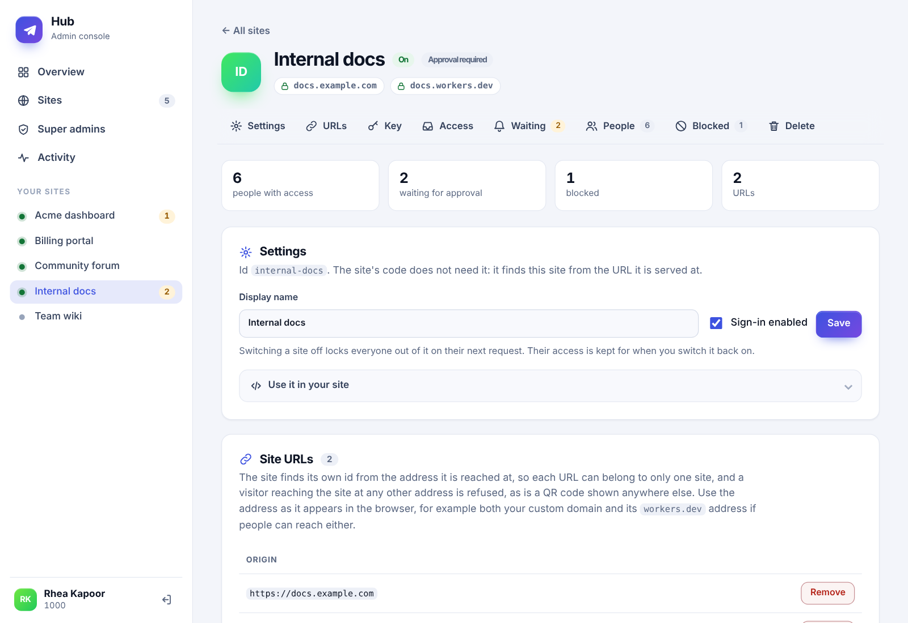

# One bot, many sites: the hub

`telegram-qr-signin/hub` lets **one Telegram bot** sign people in to **many sites**, with an **admin
console** where super admins decide who may enter which site.

It is optional and separate: nothing in the base package, the stores or the OIDC provider imports
it, and a deployment that does not use it does not load it.

## Why

A bot has exactly one webhook URL. With several sites that is awkward: either every site gets its
own bot, or one place has to know every site and route each `/start` to the right one. The hub is
that place, and it adds the missing piece — a list of who may enter which site — so the access list
lives in one database and a person is added or removed in one screen instead of one config per site.

## One authority, and sites that hold nothing

The hub is the **single authority**. It alone holds the bot token, the sign-in records and the access
list. A site holds exactly one thing from it, its **key**, and asks the hub everything over HTTPS:

```
   browser ──▶ site ──── HTTPS + key ────▶ hub ◀── webhook ── Telegram ◀── phone scans QR
              (holds only                  │
               the hub's address           ├─ starts and keeps the sign-in
               and its key)                ├─ says who scanned
                                           └─ says yes or no: may this person come in, right now?
```

- **Nothing is shared.** There is no common database, login store or KV namespace. A site has no
  binding to the hub's data, so a compromised site can start sign-ins and ask questions *for itself*
  and nothing else: it cannot read the access list, the other sites, or the admins.
- **A site can be anywhere.** The API is plain HTTPS and JSON, so a site can be on Cloudflare, another
  cloud, a VPS or a laptop, in any runtime with `fetch`.
- **The hub is the single point of failure, on purpose.** If it is down, nobody can start a sign-in,
  and signed-in people are asked to try again on their next request. Nobody is signed out because of
  an outage (see [When the hub is down](#when-the-hub-is-down)).

**Sites never hold the bot token.** Only the hub talks to Telegram, so a compromised site cannot
impersonate the bot or message your users.

## Setup

**1. The hub Worker** — [`examples/hub/hub-worker.js`](../examples/hub/hub-worker.js):

```js
import { DurableObject } from "cloudflare:workers";
import { defineQrAuthStorage, DoLoginStore } from "telegram-qr-signin/do";
import { createHub, D1HubStore } from "telegram-qr-signin/hub";

export class QrAuthStorage extends defineQrAuthStorage(DurableObject) {}   // the sign-in records

export default {
  fetch: (request, env) =>
    createHub({
      botToken: env.TELEGRAM_BOT_TOKEN,
      botUsername: env.TELEGRAM_BOT_USERNAME,
      store: new DoLoginStore(env.QRAUTH_DO),    // in-flight sign-ins: strongly consistent
      registry: new D1HubStore(env.HUB_DB),      // the access list: durable
      superAdmins: env.SUPER_ADMINS,             // "123456789,987654321"
      sessionSecret: env.CONSOLE_SESSION_SECRET, // its own secret, not the bot token
      webhookSecret: env.TELEGRAM_WEBHOOK_SECRET,
    }).fetch(request),
};
```

```bash
wrangler d1 create hub
wrangler d1 execute hub --remote --file=node_modules/telegram-qr-signin/migrations/hub-d1.sql
curl "https://api.telegram.org/bot<TOKEN>/setWebhook?url=https://<hub>/telegram/webhook&secret_token=<WEBHOOK_SECRET>"
```

The sign-in records live in a **Durable Object** (wrangler binds it: `durable_objects` and a
`new_sqlite_classes` migration, as in the example's `wrangler.jsonc`). It is strongly consistent, so a
confirmed scan is visible at once and one scan is one sign-in, and it creates its own tables, so
there is nothing to migrate. **Do not use KV for this store.** It is eventually consistent and can
leave a confirmed scan unseen for tens of seconds. D1 (`D1LoginStore`, with `migrations/d1.sql`) is
the other good choice. Either way only the hub touches it.

**2. Open `https://<hub>/admin`** and scan the QR with a Telegram account whose numeric id is in
`superAdmins`. Add a site: enter its display name and URL (`Internal docs`,
`https://docs.example.com`), and the console proposes an id (`internal-docs`) that you can edit
before saving. **The next page shows the site's key, once.** Put it in the site's secrets.

**3. Each site** — [`examples/hub/site-worker.js`](../examples/hub/site-worker.js) on Workers,
[`examples/hub/site-node.mjs`](../examples/hub/site-node.mjs) on Node. It is `createTelegramQrAuth`
with the hub standing in for every piece of shared state:

```js
import { createSiteAuth } from "telegram-qr-signin/site";

const auth = createSiteAuth({
  hub: { url: env.HUB_URL, key: env.HUB_KEY },  // https://<hub>/hub-api, and the key from step 2
  botUsername: env.TELEGRAM_BOT_USERNAME,        // no bot token
  session: { secret: env.SESSION_SECRET },       // required, and different for every site
});

const handled = await auth.handle(request);      // /auth/login, /auth/poll, /auth/logout, …
if (handled) return handled;
const gate = await auth.guard(request);          // cookie + a live question to the hub, every request
if (!gate.ok) return gate.response;
```

**4. Grant people access** under the site in the console, or let them ask: see
[Who gets in](#who-gets-in). [`docs/integrating-a-site.md`](integrating-a-site.md) is the
step-by-step guide for whoever wires up a site.

The sign-in page says which site it is: "Sign in to Internal docs", with the host it is served from
(`docs.example.com`) under the heading. The name comes from the hub and is remembered for half a
minute, so a rename in the console shows soon; if the hub cannot be asked the page still shows the
host. Set `branding.heading` to use your own heading instead (the host is still shown). The page is
the site describing itself, so it helps people notice the wrong environment, but it is not a defence:
a fake page can say anything. The bot's confirmation message, which a page cannot forge, is the check.

The site does not say which site it is. **The key does**: it reads `tqk_<site id>_<secret>`, so there
is no id to copy into code and nothing to drift out of step with the console. Everything else
`createTelegramQrAuth` takes (`branding`, `claims`, `redirectTo`, `qrOrigin`, …) works unchanged.
To also require, say, group membership, pass `authorize: chatMember({ chatId })` and a `botToken`:
it is ANDed with the hub's check.

## Site keys

A key is how a site proves who it is to the hub: `Authorization: Bearer tqk_<site>_<64 hex>`.

- **Made in the console**, when you add a site and from the site's page (*Site key*). It is shown
  **once**, on a page of its own and never in a URL; after that the hub holds only a SHA-256 of it,
  so a copy of its database cannot be turned back into working keys.
- **One per site.** Making a new key replaces the old one **at once**, so the site is locked out until
  it has the new one. Replacing needs the site's id typed back. Do it if a key leaks.
- **A site's key opens only that site.** The hub works out which site is asking from the key, never
  from the request, so a site sees only its own sign-ins and its own block list. There is no call to
  read the access list, another site, or the admins.
- A site with no key (one added by hand, or from before 1.2) cannot sign anyone in; the console flags
  it on the site's page.
- **Keep it in a secret** (`wrangler secret put HUB_KEY`), not in the repository. The key is logged
  nowhere by the hub; the audit log records that a key was made, not what it was.

## The console

Server-rendered, no JavaScript, no external requests. Everything is behind the same QR sign-in.

<p align="center">
  
</p>

- **Overview** — four numbers at the top (sites, people with access, waiting for approval, super
  admins), a card per site with its URL, status, mode and counts, the add-site form, the super
  admins, and a timeline of everything that was changed and by whom.
- **A site's page** — a header with its name, status and domains; a bar to jump to Settings, URLs,
  Access, Waiting, People, Blocked or Delete (it stays in view as you scroll); small totals; and the
  sections themselves. "Use it in your site" opens the code a site needs, which contains no id.
- **The sidebar** lists your sites with a dot for on or off and a badge for people waiting, so you can
  move between them without going back.
- **On a phone** the sidebar becomes a top bar and tables become stacked rows, with the buttons under
  what they act on instead of clipped off the edge.
- **Light and dark** follow the system setting; there is no toggle to find. Keyboard focus is always
  visible, there is a skip link, the current page is marked for screen readers, and motion is
  switched off for anyone who asks for less of it. Text meets WCAG AA contrast in both themes.

<p align="center">
  
</p>

| Area | What a super admin can do |
| --- | --- |
| **Sites** | Add a site (display name and the URL it is served from, then confirm its suggested id), rename it, switch sign-in off and on, delete it |
| **Site key** | Make a site's key (shown once, never again) or replace it. The site uses it to talk to the hub |
| **Site URLs** | Add or remove the origins a site is served from — the namespace works only there |
| **Who can sign in** | Choose one of [three modes](#who-gets-in): invite only (the default), approval required, or [open to anyone](#open-sites) with a Telegram account |
| **People with access** | Grant by Telegram id (paste many at once, with an optional note), revoke |
| **Waiting for approval** | On an approval-required site: people who scanned its QR and asked to join. Approve with one click (the bot tells them), dismiss, or block — no need to ask anyone for their numeric id |
| **Blocked people** | Refuse someone from a site whatever else is true of them — works on open sites too |
| **Super admins** | Add and remove other super admins |
| **Recent activity** | An audit log of every change: who, what, which site |

Revoking, blocking, disabling and deleting take effect on the person's **next request** to the site, not when
their cookie expires — the same live-check guarantee `chatMember` gives.

When someone is turned away from an invite-only site, the bot tells them their Telegram id and the
site's name, so they have something to send an admin.

### Roles

There are two kinds of access, deliberately separate:

- **Super admin** — can use the console. Does **not** get into any site by being one; grant
  yourself access like anyone else.
- **Site access** — a grant for one namespace. It lets someone sign in to that site and does nothing
  else. It is per site: access to `docs` opens nothing on `wiki`. (A site can instead be
  [open to anyone](#open-sites).)

**Bootstrap admins** (`superAdmins` in config) always work, cannot be removed in the console, and
never touch the database to be recognised. That is what makes locking yourself out impossible: even
with an empty or broken registry, they can sign in and repair it. Admins you add in the console are
extra, removable, and recorded with who added them. All super admins are equal; there are no
per-site administrators.

## Site ids

Each site has an **id** (the `namespace` in code): the short label that goes in the QR so the bot
knows which site a scan is for, and the stable key its access list hangs off. It is separate from the
URL on purpose. A URL can change, or gain a `workers.dev` twin, and a site can have several, but
people's access must survive that; the id is what stays put.

**The site's code never needs it.** The site's key already says which site it is, so the id lives in
one place, the registry. You only meet it in the console and in the QR link.

You rarely need to invent one. When you add a site the console proposes an id from the display name
(`Internal docs` → `internal-docs`), or from the URL's first label if there is no name
(`docs.example.com` → `docs`), adds `-2`, `-3`… if it is taken, and shows it in an editable box on a
confirmation page before anything is saved. Change it if you like; once saved it is fixed, because
the site's code and its stored access both refer to it. (An id is 1–24 letters, digits and hyphens,
and `hub-admin` is reserved for the console.)

## Binding a site to its URL

A namespace is not a domain; it is a label in the QR. Left at that, two sites at different URLs could
share one namespace — and with it one access list — by accident, the usual case being a staging copy
that borrowed production's configuration. So every site is **bound to the origin or origins it is
served from** (scheme, host and port; `https://docs.example.com`, not a path). It is required to add a
site, and enforced in two places:

- **When a site asks.** Every call that starts a sign-in or asks "may this person come in" carries the
  origin the visitor reached the site at, and the hub compares it with the registered list. A visitor,
  a session cookie or a poll arriving at any other origin gets `origin_not_allowed` and nothing from
  the hub: no sign-in, no yes, and no open-site access either. The same key does not help: a copy of
  the site on an unregistered URL cannot start sign-ins.
- **At the scan.** The QR records where it was shown. The hub compares that with the site's origins
  before it confirms anything, and tells the person when a code came from a site that is not
  registered for that namespace. The code is not spent, and nothing is remembered about it.

What the origin means in practice:

- It is **exactly what `request.url` shows**: scheme, host and port must match. `http` is refused
  (except for `localhost` and `127.0.0.1`, so you can register a dev server), and `www.` is a
  different origin. If people can reach the site at both a custom domain and its `workers.dev`
  address, register both.
- **A URL belongs to exactly one site.** Giving a URL to a second site is refused (in the console and
  by the registry), so an address always means one site. Two services on one origin under different
  paths are therefore one site.
- A site can have up to ten, so a custom domain, its `workers.dev` address and a preview can coexist.
  The console never lets you remove the last one; add the new URL first.
- Removing a URL takes effect on the next request from it.
- **Both redirects are already fixed points.** After sign-in the browser is sent only to a path on the
  *same* site, and the QR link only ever leads to `t.me/<your bot>`. Binding the namespace to the
  origin is what ties those together: the site that shows the QR, the namespace on the bot, and the
  site that receives the cookie are one origin.
- A site must record where each QR is shown, which is the default; `createSiteAuth` refuses
  `captureClient: false` for that reason.

**What this does not do.** The origin is reported by the site, so a *malicious* site holding its own
key could report any of its own registered origins (and no other site's: it can only act as the site
its key belongs to). Binding stops mistakes — staging on production's key, a copy deployed to the
wrong place, a site nobody registered — and makes each one visible; it is not a defence against a
hostile holder of a site's key. Keep keys in secrets, and make a new one if one leaks.

## Who gets in

Each site has a mode, set from its page in the console (or with `access` in `createNamespace` /
`updateNamespace`). New sites are **invite only**.

| Mode | A stranger who scans | Who the admins hear from |
| --- | --- | --- |
| **Invite only** (`granted`) | Is turned away and shown their Telegram id. Nothing is recorded about them. | Nobody: it is not a registration, so there is nothing to announce |
| **Approval required** (`approval`) | Is registered: the scan becomes a request under *Waiting for approval*, and the bot says so. | Every super admin is messaged, once per person |
| **Anyone with Telegram** (`anyone`) | Signs in. See [open sites](#open-sites). | Nobody |

In both of the first two modes only people holding a grant sign in. The difference is whether a scan
by someone you have not added is a refusal or a request, so use invite only when you know exactly
who the people are, and approval required when strangers should be able to ask.

### Approval required

The first scan is the registration, and approval is the gate behind it:

1. A person scans the site's QR code, or taps the link on their phone. The bot replies *"Request
   received. An administrator will review your request to join …, and I'll message you here once
   you're approved."* A second scan says they are still waiting, and changes nothing else.
2. Each super admin gets a message — *"Mallory (@mal) is asking to join The forum. Telegram id: …"* —
   with a link to the site's queue. It goes out once per person, and at most five times per site per
   hour: a sixth says more are arriving and that they are all in the console, and then it stops until
   the hour is up. Set `adminUrl` in `createHub` for the link to use your own address; otherwise it uses
   the address Telegram calls the webhook at.
3. In the console, **Approve** grants access and the bot messages the person: *"You've been approved
   for …. Open https://… and scan the sign-in QR code again."* They scan again and are signed in.
   Granting someone's id from *People with access* while they have a request is the same thing: the
   request goes and they are told. **Dismiss** forgets the request without telling anyone, and
   **Block** refuses them from then on.

If the bot cannot message someone (they have blocked it), the console says so and the approval still
stands: tell them yourself.

A request is only recorded for a QR that a site really minted and that is still pending, so
messaging the bot made-up payloads leaves no trace. Requests are capped per site (100, newest kept).
Switching a site to invite only hides its queue and stops recording; what was waiting is kept, and
is there again if you switch back.

## Open sites

A site can also let in **anyone with a Telegram account**, for a public site such as a forum. It is a
setting on one site, and sites are invite-only until you change it.

In the console: the site's page → Who can sign in → Open to anyone. (From code, on the hub:
`registry.createNamespace({ …, access: "anyone" })`.)

What changes, and what does not:

- **Anyone can sign in**, except people on the site's block list. The grant list stops being
  consulted but is **kept**, so going back restores it exactly.
- **Opening a site takes a deliberate step.** The console asks you to type the site's id, and the
  change is written to the audit log. Going back to invite only or approval needs no confirmation:
  narrowing access is the safe direction, and people without a grant are locked out on their next
  request.
- **There is no approval queue** on an open site — nobody to approve — and scans are not recorded.
- **A switched-off site stays off**, open or not.

**An open site is responsible for its own accounts.** The hub only proves *who someone is*: a
Telegram user id, a display name and an optional username. Everything after that is the site's job:

- Key your accounts on the **Telegram id**. Usernames can be changed or removed at any time, and
  names are whatever the person typed — escape them like any user input.
- Keep your own roles, moderation and rate limiting. Telegram accounts need a phone number, which
  makes throwaway signups harder, but it does not stop abuse.
- The hub **does not know who has signed up** to an open site, so it cannot list them. To ban
  someone, take the id from your own member record and block it in the console — or, from the site's
  own moderation tools, call `auth.block(id, "reason")` (and `auth.unblock(id)`). That is one call to
  the hub with the site's key, and it can only ever touch **this site's** block list: the key opens
  nothing else. For someone else's site, use the [OIDC provider](../README.md#running-a-public-identity-provider).

### Blocks

A block refuses one person from one site, **whatever else is true of them**: it beats a grant and
applies to open sites too. It is checked on every request, so it ends their current session on its
next request, and unblocking restores access without further action. Blocking someone also removes
their pending approval request, but leaves any grant in place — unblocking them does not silently
erase it. The bot tells a blocked person plainly that they can't sign in, without inviting them to
ask for access.

## What protects the console

- **Sign-in** is the QR flow, under the reserved namespace `hub-admin` (no site can be registered
  under it), and the "is a super admin" check runs on **every** request. Removing an admin ends
  their console session on its next click.
- **Cookie**: `HttpOnly`, `Secure`, `SameSite=Lax`, `Path=/admin`, 8 hours by default
  (`adminSessionSeconds`), signed under its own key label so a site's cookie can never pass as a
  console cookie even if a secret were reused.
- **CSRF**: every state change is a POST that must carry a token derived from the session (so one
  admin's token is useless on another's session, and a fresh sign-in retires old pages), and any
  `Origin` header must be the console's own.
- **No script injection surface**: a Content-Security-Policy that allows no scripts at all,
  `frame-ancestors 'none'`, everything user-supplied HTML-escaped, and notices chosen from a fixed
  list of codes — a crafted link cannot make the console display words you did not write.
- **Input**: Telegram ids are digits only and all-or-nothing (one typo in a pasted list adds nobody),
  site ids are validated, and nothing from a form reaches SQL except as a bound parameter.
- **Audit**: every mutation is logged with the acting admin's id. A failing log write never undoes
  or hides the change itself.

## Behaviours worth knowing

- **Sites use the default token size.** The hub recognises a scan by its shape (`<namespace>_<32 hex
  characters>`); a site that sets a custom `tokenBytes` would not be recognised.
- **One URL, one site.** A site works only at its registered URLs and only ever acts as the site its
  key belongs to. Two URLs that genuinely share an audience can be registered to one site.
- **The session cookie is named `<site id>_session`**, per origin, so sites cannot collide; change it
  with `session.cookieName`. It is signed with the site's own `session.secret`, which the hub never
  sees: signing a person in does not give the hub, or another site, the means to forge a session.
- **Deleting a site deletes its grants, its block list and its key.** Re-adding the same namespace
  later starts with nobody, with nobody banned, and with no key.
- **Switching a site off keeps its grants.** Nobody can sign in, and open sessions fail on their next
  request; switching it back on restores everyone.
- **Only approval sites remember scans, and only real QR codes.** A request is recorded only if the
  scan carried a token that a site actually minted and is still pending; messaging the bot made-up
  payloads is refused without leaving a trace. Requests are capped per site (100, newest kept), so
  the list cannot be flooded into growing without bound. Invite-only and open sites record nothing.
- **An outage is retryable, not a sign-out.** See [When the hub is down](#when-the-hub-is-down).
  Bootstrap admins can still reach the console if the registry is unreadable.
- **The login store should be strongly consistent.** A Durable Object (as in the example) or D1, never
  KV: KV is eventually consistent, and a confirmation can take tens of seconds to appear, which on a
  sign-in page is a long wait. Only the hub touches it, so it is one binding in one Worker.
- **Every guarded request costs the site one call to the hub.** That is what makes revocation take
  effect on the very next request. If that is too much, `hub: { checkCacheSeconds: 10 }` reuses a
  "yes" for that long (a "no" is never reused), at the price of revocation taking up to that long.
- **Other bot features.** The hub owns the webhook, so a bot that also does other things should
  pass those updates through `onUnhandled`, or call `hub.handleUpdate(update)` from the framework
  that already owns the webhook — it resolves `true` for a sign-in and `false` for anything else.

## What it does not do

- **No rate limiting.** The webhook is behind Telegram's secret token, and the API behind site keys,
  but `/admin/auth/*` and the sites' sign-in pages mint tokens for anyone who asks. Put rate limiting
  in front of the hub and the sites, as you would for any sign-in page.
- **No second key per site.** Replacing a key is immediate, so a rotation has a gap while the site is
  given the new one. Schedule it, or make the new key and deploy the site straight after.
- **No per-site administrators.** All super admins can change everything. If a site's owners should
  manage their own people, that is a separate role this does not model.
- **No groups, expiry or bulk import.** A grant is a Telegram id for a site; it lasts until revoked.
  The registry is a plain interface (see below), so scripts can add many people at once.
- **Grants are by numeric Telegram id.** Usernames are not resolvable by a bot, and not stable.
- **The console lists at most 500 people (and 500 blocks) per site.** Past that, manage them from the
  registry.
- **No list of an open site's members.** The hub learns nothing about who signs in to an open site
  beyond the moment of the scan.

## Using the registry from code

The console is a front end over the `HubStore` interface, which you can call directly — to seed
a new environment, import a list, or mirror grants from another system:

```js
const registry = new D1HubStore(env.HUB_DB);
await registry.createNamespace({ namespace: "docs", name: "Internal docs", origins: ["https://docs.example.com"] });
await registry.addGrant({ namespace: "docs", id: 123456789, label: "Ada" });
await registry.addBlock({ namespace: "docs", id: 555, label: "left the company" });
await registry.namespacesForOrigin("https://docs.example.com");   // ["docs"]
await registry.access("docs", 123456789);
// { exists: true, enabled: true, mode: "granted", origins: ["https://docs.example.com"], granted: true, blocked: false }
```

Direct writes skip the audit log; call `registry.appendAudit({ actor, action, target, detail })`
yourself if you want them recorded. To use a different database, implement the contract documented
at the top of [`src/hub/store.js`](../src/hub/store.js); `tests/hub-store.test.mjs` is the suite
both built-in stores pass.

## Configuration

```js
createHub({
  botToken,                  // required unless `telegram` is given
  botUsername,               // required, without the "@"
  store,                     // required — the hub's own login store (a Durable Object or D1; not KV)
  registry,                  // required — a HubStore (D1HubStore on Workers)
  superAdmins,               // required, at least one: "111,222" or [111, 222]
  sessionSecret,             // required — the console's cookie secret; not the bot token

  webhookSecret,             // the secret_token given to setWebhook — set it
  webhookPath: "/telegram/webhook",
  adminPath: "/admin",
  apiPath: "/hub-api",       // where sites call the hub; a site's `hub.url` is this on the hub's address
  adminUrl,                  // the console's public URL, for the link in "someone asked to join" messages
  adminSessionSeconds: 28800,
  qrOrigin,                  // optional, as for createTelegramQrAuth
  branding,                  // optional overrides for the console's sign-in page
  telegram,                  // bring your own client: { call(method, payload) }
  onUnhandled,               // (update) => void — updates that were not sign-ins
  onError,                   // (err, update?) => void — defaults to console.error
});
```

| Member | Purpose |
| --- | --- |
| `fetch(request)` | A complete Worker handler: the hub's routes, `404` for the rest |
| `handle(request)` | The same, but `null` for paths it does not own, so it composes with your routing |
| `webhook(request)` | Just the Telegram webhook endpoint |
| `handleUpdate(update)` | One update from a bot framework you already run; resolves `true` for a sign-in |
| `adminAuth`, `registry`, `store` | Escape hatches |

### `createSiteAuth`

```js
import { createSiteAuth } from "telegram-qr-signin/site";   // or "telegram-qr-signin/hub"

createSiteAuth({
  hub: {
    url,                     // required — the hub's API address, https://<hub>/hub-api (https; http only for localhost)
    key,                     // required — this site's key from the console
    fetch,                   // replaces global fetch (a Cloudflare service binding's, a test double)
    timeoutMs: 5000,         // how long before the hub counts as unreachable
    checkCacheSeconds: 0,    // reuse a "yes" for this long; 0 asks on every request
  },
  botUsername,               // required
  session: { secret },       // required, and different for every site
  // everything else createTelegramQrAuth takes: branding, claims, redirectTo, qrOrigin, basePath, …
  authorize,                 // optional extra gate, ANDed with the hub's (needs botToken or telegram)
  onError,                   // (err) => void — hub failures; defaults to console.error
});
```

It returns the usual site-facing object (`handle`, `guard`, `poll`, `scan`, `beginLogin`, `loginPage`,
`loginResponse`, `logoutResponse`, `getSession`, `verifyAssertion`, `authorize`) plus `block(id, label)`
and `unblock(id)`. It takes no `registry`, `store`, `namespace` or `recordRequests`: passing one throws
and says what to do instead. `telegram-qr-signin/site` loads only what a site needs (no console, no
stores, no OIDC, no Durable Objects). `hubGate({ registry, namespace })` and
`superAdminGate({ registry, rootAdmins })` are the two gates the hub itself is built from, for
composing by hand with `every` / `some`.

## The API

Sites call these with `Authorization: Bearer <key>`; `createSiteAuth` does it for you, and this is
the whole contract for a site in another language. All bodies and answers are JSON, uncached.

| Call | What it does |
| --- | --- |
| `POST /hub-api/v1/logins` | Start a sign-in. Body `{ token, expiresAt, client: { origin, ip, userAgent, at } }`. The hub refuses it if the site is off or `client.origin` is not one of the site's URLs, and never holds one longer than 15 minutes |
| `GET /hub-api/v1/logins/<token>` | `{ record }`: pending, or confirmed and by whom; `null` if there is none |
| `POST /hub-api/v1/logins/<token>/consume` | Takes a confirmed sign-in, once; `{ record: null }` if it was not confirmed, or is already taken |
| `DELETE /hub-api/v1/logins/<token>` | Forget one |
| `POST /hub-api/v1/check` | `{ user: { id }, stage: "poll" \| "session", origin }` → `{ ok: true }` or `{ ok: false, reason }`. A refusal is a normal `200` |
| `GET /hub-api/v1/site` | `{ namespace, name, enabled, origins }`: this site's own details |
| `POST /hub-api/v1/blocks`, `DELETE …/blocks/<id>` | This site's own block list |

| Status | Meaning |
| --- | --- |
| `401` | The key is missing, malformed or wrong. Always the same answer, whatever was wrong |
| `403` | `origin_not_allowed`, or `namespace_disabled` |
| `400`, `413`, `405`, `404` | A bad request, a body over 4 KB, the wrong method, an unknown route |
| `503` + `Retry-After: 5` | The hub could not read its own data. Retry |

Whatever the call, the hub decides which site is asking **from the key alone**: a `namespace` in a
body is ignored. `stage: "confirm"` is refused, because confirming a scan is the bot's job at the hub
and it is what records a request.

## When the hub is down

The hub is the single point of failure, so it is worth being exact about what happens:

- **Nobody can start a sign-in.** The sign-in page answers `503` "Sign-in is temporarily
  unavailable", with `Retry-After`. A page that is already open keeps polling and recovers by itself.
- **Nobody is signed out.** A guarded request that cannot be checked answers `503`, **without**
  clearing the cookie, so the same cookie works again the moment the hub is back. An outage, a
  timeout (`hub.timeoutMs`), and a wrong or revoked key all look like this to a visitor; the cause
  is reported to `onError`, with a `HubError` whose `code` says which (`hub_unreachable`,
  `hub_unavailable`, `unauthorized`).
- **Signing out still works**, because clearing a cookie needs no one.
- **Sites you do not deploy together stay independent.** One site's bad key affects only that site.

## Refusal reasons

A custom sign-in page or log can tell these apart (`ctx.stage` is as in README → *Authorization*):

| `reason` | Meaning |
| --- | --- |
| `not_granted` | An invite-only site, and this person has no grant |
| `blocked` | This person is on the site's block list (beats a grant; applies to open sites) |
| `namespace_disabled` | The site is switched off in the console (open or not) |
| `pending_approval` | An approval-required site, and this person has no grant yet (`requested` says whether this scan was recorded) |
| `origin_not_allowed` | The request reached the site at a URL that is not registered for it |
| `unknown_namespace` | The site is not registered (deleted, or never added) |
| `not_admin` | A scan of the console's QR by someone who is not a super admin |
| `hub_unavailable` | The registry could not be read, or the hub could not be reached — transient, retry |
| `not_supported` | A site was asked to confirm a scan; only the hub's bot does |
